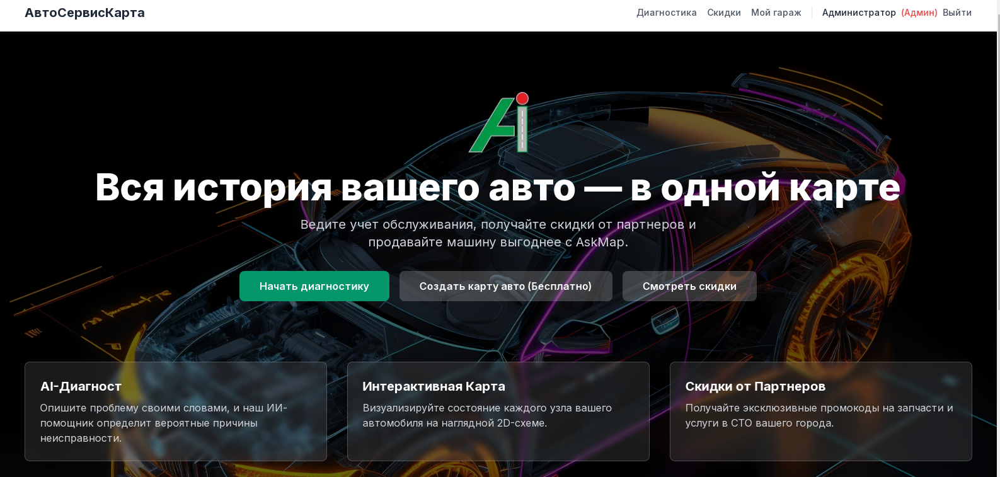
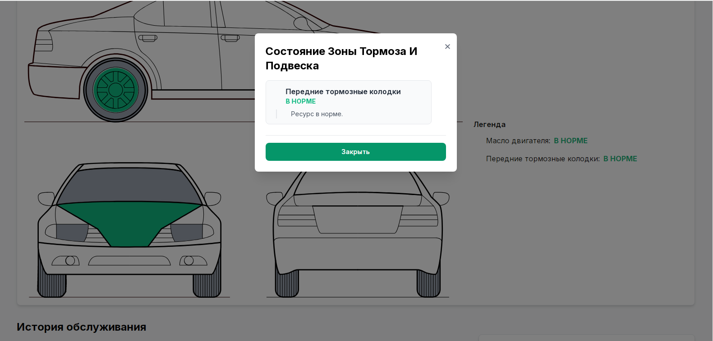
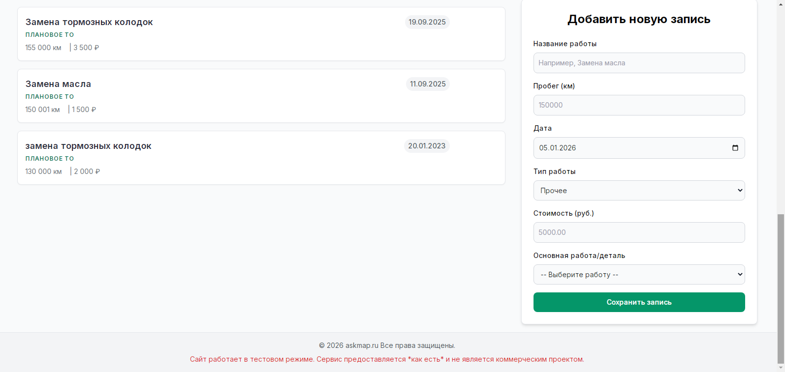
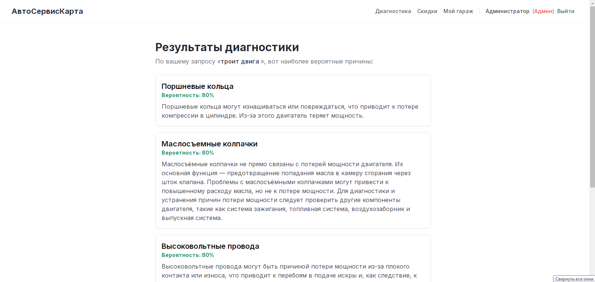
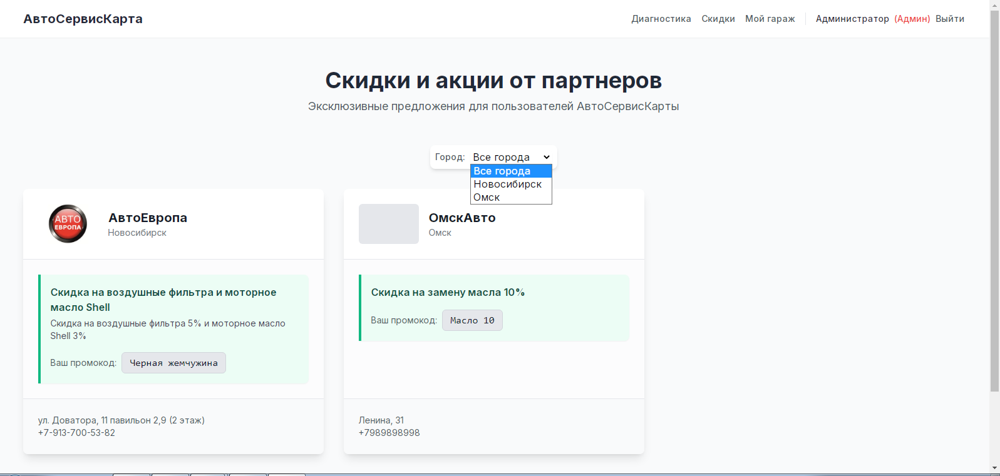
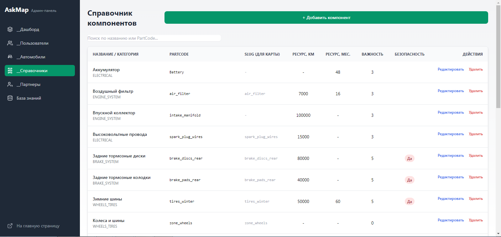
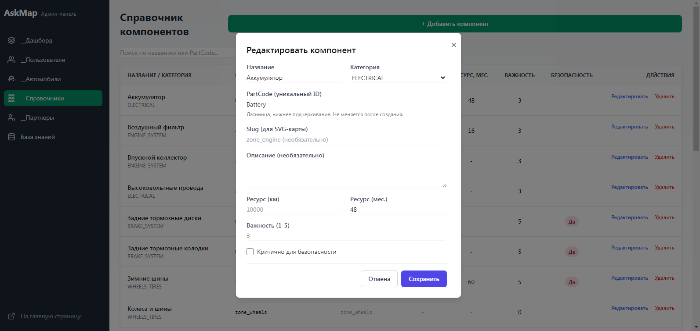
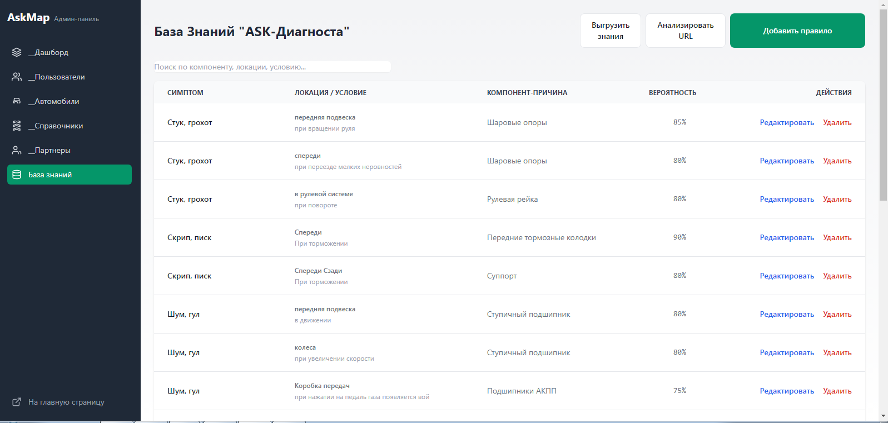
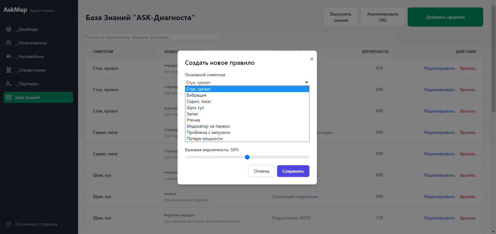
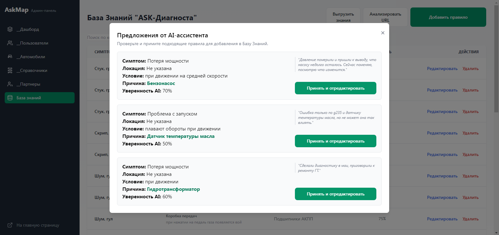

# AskMap.auto - AI-Powered Automotive Companion (Case Study)


**Концепция: "Google Переводчик + Shazam для вашего автомобиля"**

**AskMap.auto** — это полнофункциональный MVP (Minimum Viable Product) веб-приложения, разработанного для помощи автовладельцам. Проект был создан как кейс-стади, демонстрирующий построение сложной full-stack экосистемы с глубокой интеграцией AI.

Разработка велась в сотрудничестве с AI-ассистентами , используя методологию, которую можно назвать "AI-Assisted Wave Coding" — итеративная разработка, где AI выступает в роли "второго пилота", предлагая код и помогая в отладке.

---

## Скриншоты Проекта













---

## Ключевые реализованные фичи

Проект разделен на две основные части: клиентский портал и мощную админ-панель.

### 1. Клиентский портал
*   **Гибридный AI-Диагност:** Пользователь описывает проблему (например, "стучит спереди на кочках") своими словами. Система использует AI для нормализации запроса и обогащения его ключевыми словами, а затем с помощью собственного надежного алгоритма находит в "Базе Знаний" наиболее релевантные причины неисправности.
*   **Цифровой Паспорт Автомобиля:**
    *   Личный "Гараж" с возможностью добавлять/редактировать/удалять автомобили.
    *   Ведение полной истории обслуживания с привязкой к конкретным деталям, пробегу, стоимости и типу работ.
    *   **Интерактивная 2D-карта автомобиля,** которая в реальном времени визуализирует состояние узлов (ОК/Внимание/Критично) на основе истории обслуживания и нормативного ресурса деталей.
*   **Экосистема Партнеров:** Каталог СТО и магазинов, предоставляющих скидки пользователям платформы, с возможностью поиска и фильтрации.

### 2. Админ-панель
*   **Полноценный CRUD:** Единый интерфейс для управления всеми сущностями системы: пользователями, автомобилями, партнерами, скидками, справочником компонентов.
*   **Управление "Базой Знаний":** Отдельный раздел для создания и редактирования правил "Симптом -> Причина", на которых работает AI-Диагност.
*   **AI-Ассистент для наполнения базы:** Уникальный инструмент, который по URL-ссылке на автомобильный форум парсит текст обсуждения, анализирует его с помощью AI и предлагает администратору готовые, предзаполненные правила. Включает **"нечеткий" поиск** для сопоставления предложенных AI названий с существующим справочником, **предотвращая создание дублей**.
*   **Надежный workflow "Knowledge-as-Code":** Реализован механизм экспорта "Базы Знаний" и "Справочника компонентов" в единый JSON-файл прямо из админ-панели для последующего версионирования в Git и безопасного развертывания через `prisma db seed`.
*   **Масштабируемость:** Внедрена универсальная, переиспользуемая система поиска и пагинации (`useDataTable`) для всех таблиц в админ-панели.

---

## Технологический стек

*   **Фреймворк:** Next.js 13+ (App Router, Server & Client Components)
*   **Язык:** TypeScript
*   **Бэкенд:** Next.js API Routes (Node.js)
*   **База данных:** PostgreSQL
*   **ORM:** Prisma
*   **Стилизация:** Tailwind CSS
*   **Аутентификация:** Next-Auth (Credentials Provider)
*   **AI:** YandexGPT (через прямой REST API)
*   **Веб-скрапинг (в админке):** `cheerio`
*   **Деплой:** VPS (Ubuntu), Nginx (reverse proxy), PM2 (менеджер процессов), Certbot (SSL)
*   **PWA:** `next-pwa` для создания Progressive Web App.

---

## Статус проекта и ключевые выводы

**Статус: Проект приостановлен после успешной реализации MVP.**

В ходе разработки и первичного исследования с фокус-группой был сделан критически важный продуктовый вывод: **ценность "Цифрового Паспорта" напрямую зависит от легкости его наполнения.**

Проект столкнулся с фундаментальной проблемой — **"человеческой ленью"**. Большинство пользователей не готовы регулярно и дисциплинированно вносить данные об обслуживании вручную, даже при наличии удобного интерфейса. Это делает "умный калькулятор" состояния и интерактивную карту менее полезными, так как они работают на неполных данных.

Это стало главной причиной приостановки проекта перед началом **Фазы 2**, которая должна была решить эту проблему путем внедрения **OCR-распознавания чеков**.

**Главный урок:** Технологически совершенный продукт может оказаться несостоятельным, если он не учитывает реальные поведенческие паттерны пользователя. Решение должно быть не просто "удобным", а **"магически простым"**.

---

## Как запустить проект локально

1.  **Клонируйте репозиторий:**
    ```bash
    git clone https://github.com/SlavaKuzkinHackathon/askmap.auto.git
    cd askmap
    ```
2.  **Установите зависимости:**
    ```bash
    npm install
    ```
3.  **Настройте переменные окружения:**
    *   Скопируйте `.env.example` в `.env`.
    *   Заполните ваши данные для `DATABASE_URL`, `NEXTAUTH_SECRET`, `YANDEX_FOLDER_ID`, `YANDEX_API_SECRET_KEY` и `YANDEX_SERVICE_ACCOUNT_ID`.
    *   **Для создания администратора,** укажите `ADMIN_EMAIL` и `ADMIN_PASSWORD`. Эти данные используются **только** при первом запуске `db seed` для создания вашей учетной записи в базе данных. Пароль в базе хранится в виде безопасного хеша.

4.  **Настройте базу данных:**
    *   Убедитесь, что у вас запущен локальный сервер PostgreSQL.
    *   Выполните следующие команды для создания структуры базы и наполнения ее начальными данными:
    ```bash
    # Создает миграцию, если ее нет, и применяет ее к базе
    npx prisma migrate dev --name init
    # Заполняет базу справочниками, правилами из JSON и создает админа
    npx prisma db seed
    ```

5.  **Запустите проект:**
    ```bash
    npm run dev
    ```
    Откройте `http://localhost:3000` в вашем браузере.

---

## Лицензия

Проект распространяется по лицензии MIT.
